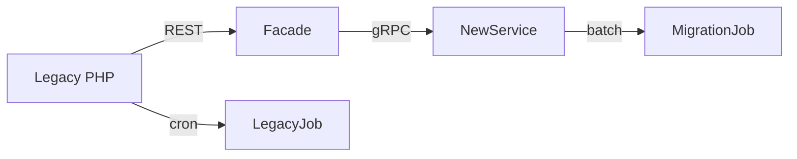

# Migrating Hybricks from PHP to Spring Boot

When I joined Sahoepyeongron the flagship LMS, **Hybricks**, still ran on a PHP stack that had grown over ten years. Feature work stalled because every release meant a risky manual deploy and a weekend on-call. Here is how we moved the service to Spring Boot without interrupting tens of thousands of students.

## 1. Sketching the target architecture

Our goals were simple: type-safe domain code, predictable releases, and infrastructure we could replicate for the next service. We settled on:

- Spring Boot 3 + Spring Data JPA for the application layer
- MariaDB (managed on AWS RDS) with Flyway migrations
- GitHub Actions running unit tests, integration tests, and container builds
- AWS ECS with blue/green deploys and CloudFront in front of ALB

The first two weeks were spent pairing with ops to map PHP endpoints to new controllers and modelling “course”, “subscription”, and “billing” as aggregates we could test.

## 2. Building the bridge

Instead of a big bang switch we introduced a strangler facade:

- **Facade**: a lightweight Spring Boot service that copied calls to the new API while still hitting PHP for the canonical answer.
- **MigrationJob**: nightly Spring Batch jobs that replayed delta changes into the new schema and reported mismatches.
- **Observability**: logs to CloudWatch + 1% request sampling to Sentry caught payload issues before we promoted new endpoints.

## 3. Cut-over weekend

Once batch diffs hit zero for two consecutive weeks we scheduled a Friday evening migration:

1. Freeze writes in PHP, run the final Spring Batch sync (12 minutes).
2. Flip ALB routing from the PHP autoscaling group to the ECS service.
3. Run smoke tests (GitHub Actions workflow) against production endpoints.
4. Remove the strangler facade, keeping PHP up for read-only fallbacks for 24 hours.

The new stack handled **2.3x** peak traffic with a **30%** lower p95 response time, and deploy cadence moved to weekly without manual database scripts.

## 4. What we’d repeat (and avoid)

- Prototype the migration pipeline early; it doubled as business documentation.
- Co-design the CI pipeline with ops so infrastructure drift is everyone’s problem.
- Avoid re-implementing every helper abstraction from PHP. We killed several by asking, “does the domain really need this?”

Moving Hybricks set the blueprint for the rest of our services, including Quest and YongClass. Every new project now starts from a reusable Spring Boot template with automated releases baked in.
