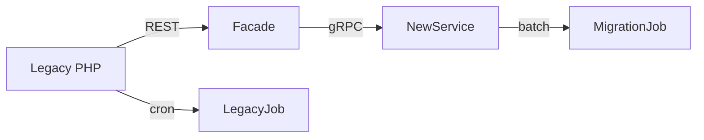

# Hybricks를 PHP에서 Spring Boot로 옮기기

입사 당시 주력 LMS인 **Hybricks**는 10년 넘게 누적된 PHP 코드와 수동 배포 절차 때문에 기능 개발이 더뎠습니다. 이 글은 서비스를 중단하지 않고 Spring Boot로 전환한 과정을 정리한 것입니다.

## 1. 목표 아키텍처 그리기

- Spring Boot 3 + Spring Data JPA
- AWS RDS(MariaDB) + Flyway
- GitHub Actions 기반 CI/CD, ECS Blue/Green 배포
- CloudFront + ALB 조합으로 TLS와 캐싱 일원화

두 주 동안 기존 PHP 엔드포인트를 정리하고, 수업/구독/정산 도메인을 도식화해 테스트 가능한 모델을 만들었습니다.

## 2. 스트랭글러 패턴 적용

- **Facade**: PHP와 새 API를 동시에 호출하는 얇은 Spring Boot 서비스
- **MigrationJob**: 밤마다 변경분을 동기화하고 차이를 리포트하는 Spring Batch job
- **관측성**: CloudWatch + Sentry로 1% 트래픽을 샘플링하여 payload 오류를 조기에 감지

## 3. 컷오버 주말 시나리오

1. PHP 쓰기를 잠궈 마지막 Batch 동기화를 실행 (약 12분)
2. ALB 라우팅을 ECS 서비스로 전환
3. GitHub Actions가 프로덕션 스모크 테스트를 수행
4. 24시간 동안 PHP를 읽기 전용으로 유지한 뒤 완전히 종료

전환 후 p95 응답 시간이 30% 감소했고, 릴리스 주기는 월 1회에서 주 1회로 단축되었습니다.

## 4. 회고 포인트

- 마이그레이션 파이프라인을 문서화하면 비즈니스와 개발이 같은 언어를 쓸 수 있습니다.
- CI/CD는 운영과 함께 설계해야 인프라 드리프트를 막을 수 있습니다.
- PHP에서 쓰던 헬퍼를 그대로 옮기지 말고 도메인에 필요한지부터 확인해야 합니다.

Hybricks 전환 경험 덕분에 이후 Quest와 YongClass도 동일한 템플릿으로 빠르게 구축할 수 있었습니다.
